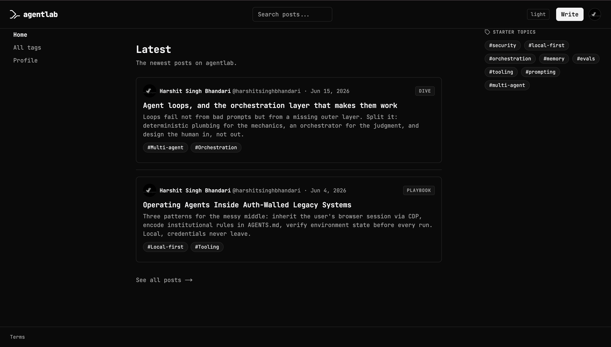

# journal

[](https://github.com/agentlab-in/journal/actions/workflows/ci.yml)
&nbsp;·&nbsp; **Live:** [journal.agentlab.in](https://journal.agentlab.in)
&nbsp;·&nbsp; Next.js 16 · React 19 · TypeScript (strict) · Supabase · Vercel

**journal** is agentlab.in's full-stack community publishing platform for AI agent infrastructure knowledge: posts, playbooks, and deep dives written by practitioners, for practitioners. Think Hacker News meets Substack, purpose-built for the systems side of AI agents.

Built solo, end to end: authentication, a Markdown/MDX authoring pipeline, social graph (follows, likes, bookmarks), discovery (search, tags, trending), a complete moderation back office, and the production hardening (rate limiting, sanitization, accessibility, legal pages) that a real publishing platform needs.

<!-- Screenshots: add 2-3 to docs/screenshots/ and reference them here.
     Suggested shots: home/discovery feed, a rendered post with code + Mermaid, the admin moderation dashboard. -->
<!--  -->

## Highlights

What this project demonstrates, beyond a standard CRUD app:

- **Real moderation back office.** Admin surfaces for user bans, content reports with a resolution workflow, tag review, and a full audit log. Bans revoke live sessions, not just flags.
- **Secure content pipeline.** User-authored Markdown/MDX rendered through a `unified` pipeline with `rehype-sanitize`, syntax highlighting, and Mermaid diagrams, safe against XSS from untrusted input.
- **Production hardening.** Upstash-backed rate limiting on write paths, GitHub OAuth via NextAuth with a Supabase adapter, and a legal surface (privacy, terms, DMCA, grievance).
- **Accessibility as a gate.** Automated axe-core checks run in CI, not as an afterthought.
- **Serious test discipline.** 160+ test files spanning Vitest unit tests, Playwright end-to-end flows, and accessibility specs. The full suite (type-check, lint, unit, e2e, a11y) runs on every push.
- **Discovery that scales.** Search, tag pages, a trending algorithm, and per-user and per-tag RSS feeds.

## Tech stack

| Layer | Choice |
|---|---|
| Framework | Next.js 16 (App Router, RSC) |
| Language | TypeScript (strict) |
| UI | React 19 · Tailwind CSS 4 |
| Auth | NextAuth.js · GitHub OAuth · Supabase adapter |
| Data | Supabase (Postgres) |
| Content | `unified` / `remark` / `rehype` · MDX · Mermaid · CodeMirror editor |
| Infra | Vercel · Upstash (rate limiting) |
| Validation | Zod |
| Testing | Vitest · Playwright · axe-core |

## Architecture

Full implementation plan and design decisions: [`docs/v1-plan.md`](docs/v1-plan.md).

The app is built on the Next.js App Router, with React Server Components for data-heavy read paths and route handlers under `app/api/*` for mutations. Auth is GitHub OAuth through NextAuth, persisted to Supabase via the adapter. Content flows through a server-side `unified` pipeline that sanitizes untrusted Markdown before render. Admin and moderation live under `app/admin/*`, gated by an env-configured allowlist.

## Local development

```bash
pnpm install               # install dependencies
cp .env.example .env.local # copy env template (see file for all vars)
pnpm dev                   # dev server at http://localhost:3010
```

### Testing

```bash
pnpm test        # unit tests (Vitest)
pnpm e2e         # end-to-end tests (Playwright, starts next dev automatically)
pnpm a11y        # accessibility specs (axe-core)
```

### Other scripts

```bash
pnpm typecheck   # TypeScript type-check (tsc --noEmit)
pnpm lint        # ESLint
pnpm format      # Prettier write
pnpm build       # production build
```

### Supabase setup (one-time)

Before sign-in works locally, complete these against your Supabase project:

1. **Push the auth migration:**
   ```bash
   supabase db push   # applies supabase/migrations/0001_auth.sql
   ```
2. **Expose the `next_auth` schema to PostgREST.** In the Supabase dashboard:
   *Project Settings > API > Exposed schemas > add `next_auth`.* Without this
   the NextAuth adapter fails with `Invalid schema: next_auth (PGRST106)`.
3. **Fill `.env.local`** with `NEXTAUTH_SECRET`, `GITHUB_CLIENT_*`,
   `NEXT_PUBLIC_SUPABASE_URL`, `NEXT_PUBLIC_SUPABASE_ANON_KEY`,
   `SUPABASE_SERVICE_ROLE_KEY`.
4. **GitHub OAuth app:** the dev callback URL is
   `http://localhost:3010/api/auth/callback/github` (port 3010, not 3000).

See `.env.example` for all required and optional variables with documentation.
